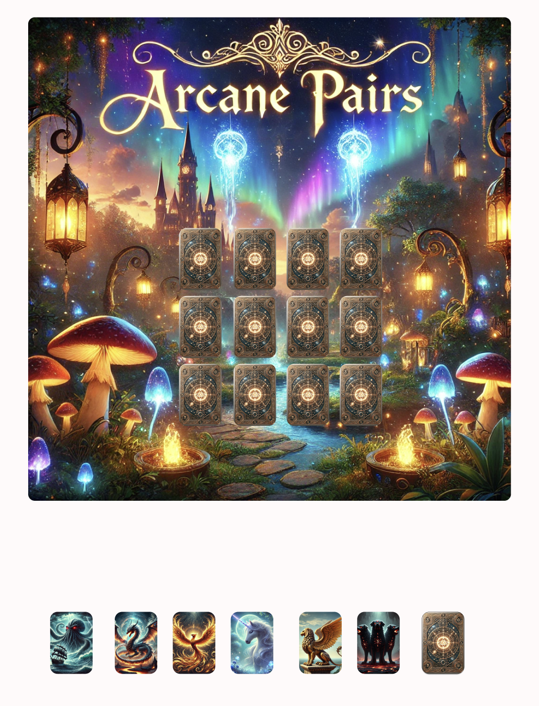

### Arcane Pairs

## What is Arcane Pairs

Arcane Pairs is a card matching game utlizing fantasy/mythology figures or beasts. It will feature a pair matching objective featured on a 4x3 grid. The game is a time based with a countdown logic.
Upon completion of all pairs the user will be greeted with a winning message, or if unable to complete all pairs, they will be greeted with a losing message.

### Technology used

HTML
CSS
Javascript

### Future Steps

Implement a difficulty aspect which will adjust the timer according to difficulty choices. "Easy", "Medium", "Hard"

Get my shuffle animation to work properly as well as add a flipping feature

https://matthewstasiak97.github.io/Arcane-Pairs/
